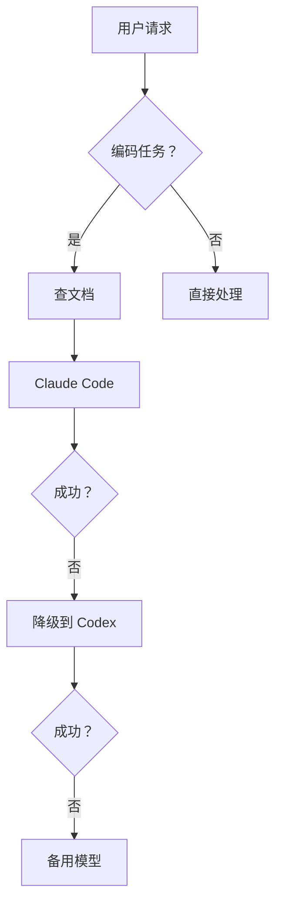
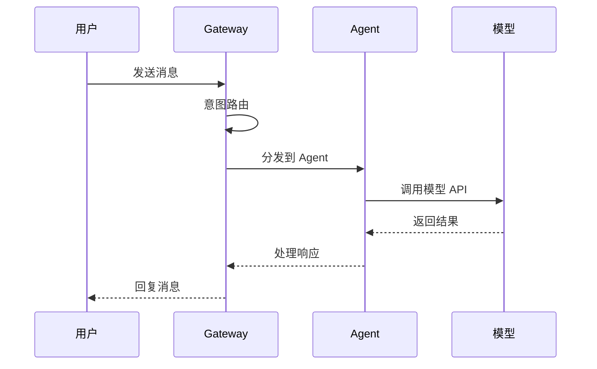

# Slidev Demo

合并展示：排版 · 代码 · 图表 · Mermaid · 动画

---

# 目录

<v-clicks>

- 排版布局 — 双栏、中心、卡片网格
- 代码高亮 — Shiki + 行号
- 数据图表 — ECharts / vue-echarts
- 流程图 — Mermaid 原生支持
- 逐步动画 — v-clicks
- 多 Deck 构建 — GitHub Pages 自动发布

</v-clicks>

---
layout: two-cols
layoutClass: gap-16
---

# 双栏布局

左侧放文字要点，右侧放辅助内容。

<v-clicks>

- 支持 `two-cols` 布局
- 可通过 `::right::` 分隔
- 适合对比、图文并排

</v-clicks>

::right::

## 卡片网格示例

<div class="grid grid-cols-2 gap-4 mt-4">

<div class="bg-blue-500/10 p-4 rounded-lg border border-blue-500/30">

**ECharts**
数据图表首选

</div>

<div class="bg-green-500/10 p-4 rounded-lg border border-green-500/30">

**Mermaid**
流程图 / 架构图

</div>

<div class="bg-purple-500/10 p-4 rounded-lg border border-purple-500/30">

**Shiki**
VS Code 级代码高亮

</div>

<div class="bg-orange-500/10 p-4 rounded-lg border border-orange-500/30">

**v-clicks**
逐步揭示内容

</div>

</div>

---
layout: two-cols
---

# 代码高亮

Shiki 引擎，VS Code 同款渲染。

```js {1|2-4|5|all}
import VueECharts from 'vue-echarts'
import { use } from 'echarts/core'
import { CanvasRenderer } from 'echarts/renderers'

use([CanvasRenderer])
```

::right::

## 行号 + 多语言

```python {monaco}
def greet(name: str) -> str:
    return f"Hello, {name}!"

print(greet("Slidev"))
```

支持行号、行高亮、代码块逐步显示。

---
layout: center
---

# ECharts 数据图

Slidev 本身基于 Vue 3，直接嵌入 `vue-echarts` 组件即可。

<div class="text-sm text-gray-400 mt-4">

推荐使用 `<Chart :option="..." />` 封装，避免在 `slides.md` 中写大量初始化逻辑。

</div>

---

<Charts />

统一封装后，`<Charts />` 组件自带折线图和雷达图。

---

# Mermaid 流程图

Slidev 原生支持 Mermaid，无需额外插件。



---



Mermaid 也支持时序图、甘特图、类图等。

---

# 逐步动画

<v-clicks>

- 第一条：默认隐藏，按键后出现
- 第二条：同上，逐步揭示
- 第三条：适合长列表，不一次倾倒
- 第四条：避免信息过载

</v-clicks>

---

# 方案对比

<table class="w-full text-sm">
<thead>
<tr class="border-b-2 border-gray-600">
  <th class="text-left py-3">方案</th>
  <th class="text-left py-3">适用场景</th>
  <th class="text-left py-3">复杂度</th>
</tr>
</thead>
<tbody class="text-gray-300">
<tr class="border-b border-gray-800">
  <td class="py-3 font-medium">vue-echarts</td>
  <td class="py-3">数据图、关系图</td>
  <td class="py-3 text-green-400">低（封装后传 option）</td>
</tr>
<tr class="border-b border-gray-800">
  <td class="py-3 font-medium">Mermaid</td>
  <td class="py-3">流程图、时序图</td>
  <td class="py-3 text-green-400">极低（Markdown 内写）</td>
</tr>
<tr class="border-b border-gray-800">
  <td class="py-3 font-medium">Chart.js</td>
  <td class="py-3">简单柱状/折线/饼图</td>
  <td class="py-3 text-yellow-400">中</td>
</tr>
<tr>
  <td class="py-3 font-medium">Vega-Lite</td>
  <td class="py-3">数据分析、可重复图表</td>
  <td class="py-3 text-yellow-400">中高</td>
</tr>
</tbody>
</table>

---

# 多 Deck 构建

每个 PPT 一个目录，统一构建发布。

```txt
decks/
  demo/
    slides.md
  product-intro/
    slides.md
  tech-sharing/
    slides.md
```

在 `scripts/build.mjs` 的 `decks` 数组中登记，push 后 GitHub Pages 自动更新。

---
layout: center
class: text-center
---

# 谢谢

## Q&A

<div class="pt-4 text-sm opacity-80">

https://coney.github.io/slides/demo/

</div>
