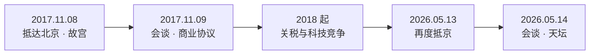

China / U.S. / Power Diplomacy

# 川普访华 从故宫到天坛

两次访问，两个场景：2017 的“礼遇与订单”，2026 的“竞争与控险”。

  
2017 故宫

2026 天坛

贸易

AI / 芯片

台湾 / 伊朗

公开资料整理 · 更新于 2026-05-14

---
class: deck
---

The Core

# 一句话判断

  

    
2017

    
把合作氛围 做到极致

    
故宫、京剧、晚宴、商业大单：重点是“关系还有想象空间”。

  

  

    
2026

    
在竞争里 寻找刹车

    
贸易、AI、台湾、伊朗、供应链：重点是“别让风险失控”。

  

  我的看法： 访问本身不是答案，它只是把中美关系的阶段性矛盾压缩成一个可观看的画面。

---
class: deck
---

Timeline

# 五个节点，看关系转向

关系主轴从“扩大合作窗口”，逐步转向“管理竞争风险”。

---
class: deck bg-forbidden
---

Scene 01

# 2017：故宫外交

  
它不是景点安排， 是外交叙事。

  <ul class="clean">
    <li>→ 故宫前三殿、茶叙、京剧、晚宴</li>
    <li>→ 高规格礼遇塑造合作气氛</li>
    <li>→ 文明与历史感，压住现实分歧</li>
  </ul>

图：故宫 / Wikimedia Commons

---
class: deck bg-hall
---

Deals & Frictions

# 大单很大， 问题也很大

  

$250B+

商业与投资协议量级

  

6

能源、航空、农业等领域

  

未解

逆差、准入、产业政策

签单能改善气氛，但不能自动解决结构性不信任。

---
class: deck bg-tech
---

After 2017

# 访问窗口关闭， 竞争窗口打开

  

Tariffs
<h2 class="mt-5">关税</h2>
贸易逆差争议升级为关税攻防。

  

Tech
<h2 class="mt-5">科技</h2>
芯片、AI、出口管制成为新主轴。

  

Supply Chain
<h2 class="mt-5">供应链</h2>
效率优先让位于安全与韧性。

---
class: deck bg-temple
---

Scene 02

# 2026：天坛会谈

  
这次不是蜜月， 而是风险管理。

  <ul class="clean">
    <li>→ 5 月 13 日晚抵京</li>
    <li>→ 5 月 14 日人民大会堂会谈逾 2 小时</li>
    <li>→ 会后同游天坛，象征“秩序与稳定”</li>
  </ul>

图：天坛 / Wikimedia Commons

---
class: deck
---

2026 Agenda Map

# 议题已经升级

<Chart :option="agendaOption" height="355px" />

议题强度为演示性归纳，用于比较两次访问的议程重心，不代表统计评分。

---
class: deck
---

2017 vs 2026

# 从“扩大蛋糕”到“划清边界”

  

    
2017

    <h2 class="mt-4">故宫</h2>
    
礼遇订单朝核贸易逆差

    
核心是：制造合作窗口，让市场看到确定性。

  

  

    
2026

    <h2 class="mt-4">天坛</h2>
    
AI芯片台湾稀土伊朗

    
核心是：给竞争装护栏，避免误判升级。

  

---
class: deck
---

My Takeaways

# 四个观察

  

01
<h2 class="mt-4">仪式感就是谈判</h2>
故宫和天坛都在给谈判加历史与秩序叙事。

  

02
<h2 class="mt-4">稳定本身是成果</h2>
高度竞争下，能继续谈、避免误判，已经有价值。

  

03
<h2 class="mt-4">企业是缓冲器</h2>
商业利益能拉住关系，但不再单独决定方向。

  

04
<h2 class="mt-4">订单不是答案</h2>
2017 证明，大单能改善气氛，但解决不了结构性不信任。

---
class: deck cover
---

Final Frame

# 今天的中美关系

  

  红毯、古建筑、友好措辞， 
  和关税、芯片、台湾、战争、供应链， 
  同时存在。
  

必须合作，但无法回到单纯合作。

---
class: deck
---

Sources

# 资料来源

  

    <ul class="clean">
      <li>中国外交部：2026 访华公告、会谈消息</li>
      <li>白宫档案：2017 联合记者会、企业活动讲话</li>
      <li>Reuters：2026 访华议题、企业代表团、AI/台湾/伊朗报道</li>
    </ul>
  

  

    <ul class="clean">
      <li>BBC 中文：会谈逾 2 小时、同游天坛</li>
      <li>Xinhua / SCMP / CNBC：2017 故宫行程与经贸协议</li>
      <li>Wikimedia Commons / Unsplash：配图素材</li>
    </ul>
  

注：2026 年访问仍在进行中，后续成果可能继续更新。

