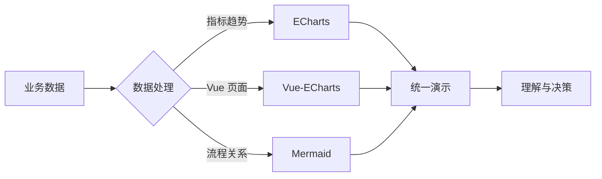
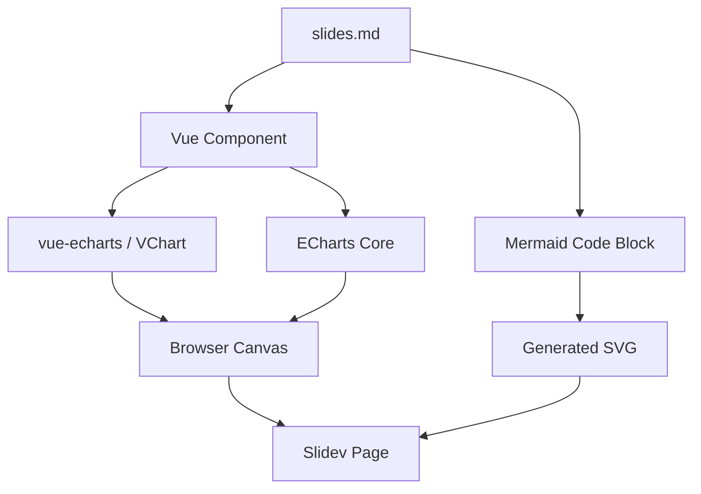

Visualization Stack / Live Demo

# ECharts Vue-ECharts Mermaid

一份可运行的 Slidev 示例：数据图表、Vue 组件和流程图在同一套演示里协作。

  Slidev
  Vue 3
  ECharts
  Mermaid

基于仓库现有 Demo Deck 结构生成 · 2026-06-10

---
class: viz-deck
---

Why This Stack

# 三种表达，各司其职

  

    
01

    <h2>ECharts</h2>
    
直接控制实例，适合复杂交互、事件联动与精细性能调优。

  

  

    
02

    <h2>Vue-ECharts</h2>
    
把图表变成 Vue 组件，配置响应式更新，更适合业务页面组合。

  

  

    
03

    <h2>Mermaid</h2>
    
用文本维护流程、架构和时序，版本差异清晰，修改成本低。

  

---
class: viz-deck
---

Live Charts

# 同一份数据，两种接入方式

<VisualChart class="mt-6" />

左侧通过 <code>echarts.init()</code> 创建实例；右侧通过 <code>&lt;VChart&gt;</code> 声明式渲染。

---
class: viz-deck
---

Mermaid Flow

# 从数据到决策

图表负责“量”，流程图负责“关系”，Slidev 负责把它们组织成叙事。

---
class: viz-deck
---

Architecture

# 页面结构保持简单

---
class: viz-deck
---

Selection Guide

# 怎么选

  

    
直接用 ECharts

    <ul>
      <li>需要手动管理实例和生命周期</li>
      <li>大量事件联动或底层能力</li>
      <li>追求最明确的控制边界</li>
    </ul>
  

  

    
优先 Vue-ECharts

    <ul>
      <li>项目本身使用 Vue 3</li>
      <li>配置来自响应式状态</li>
      <li>图表需要复用为业务组件</li>
    </ul>
  

Mermaid 不参与二选一：它用于描述流程、架构和关系，可与两者同时使用。

---
class: viz-deck cover
---

Takeaway

# 数据可视化 不只是一张图

ECharts 提供能力， 
Vue-ECharts 提供工程化， 
Mermaid 提供结构表达。

按方向键浏览 · 按 O 查看全部页面

